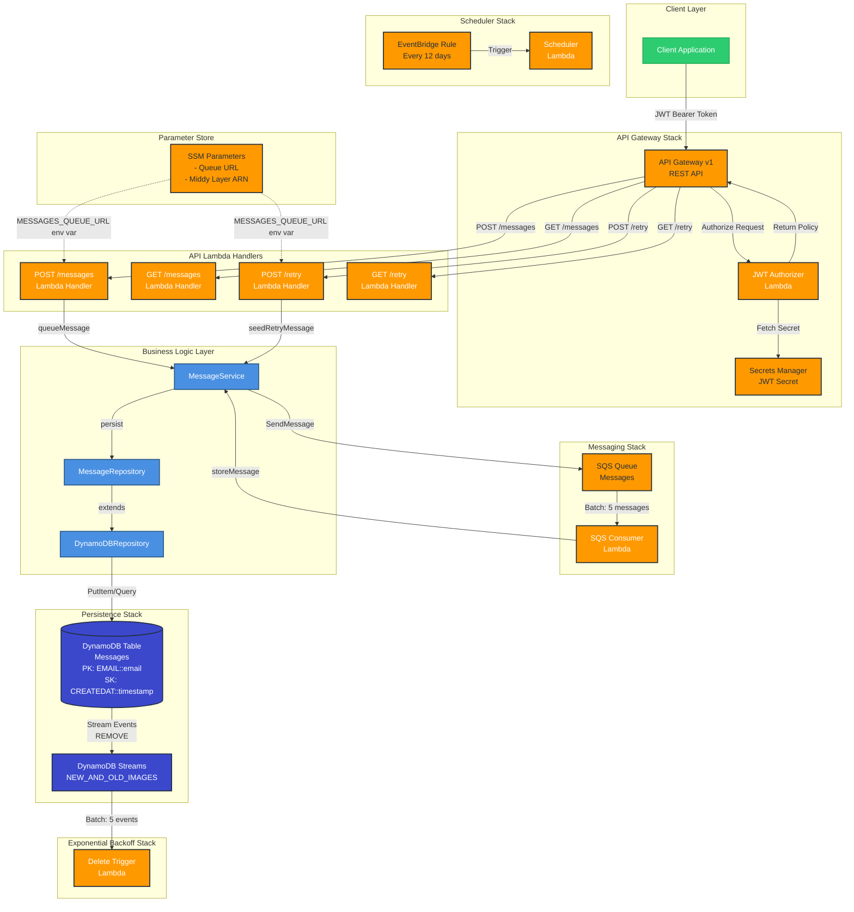
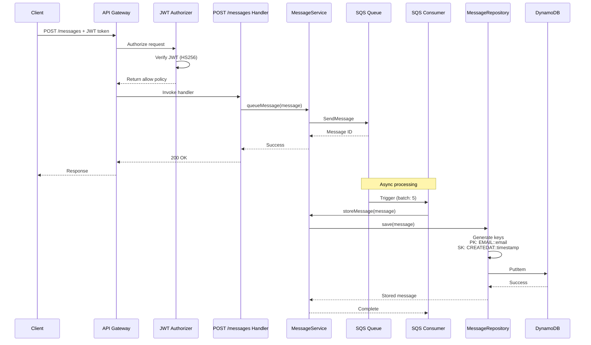

# System Architecture

## Component Diagram



## Data Flow Sequences

### 1. Message Submission Flow



## Component Responsibilities

### Infrastructure Stacks

| Stack | Components | Responsibility |
|-------|-----------|----------------|
| **BaseStack** | Orchestrator | Coordinates all child stacks, manages dependencies |
| **PersistenceStack** | DynamoDB Table | Message storage with streams enabled |
| **MessagingStack** | SQS Queue + Consumer | Async message processing |
| **ApiStack** | API Gateway + Handlers + Authorizer | REST API endpoints with JWT auth |
| **SchedulerStack** | EventBridge + Lambda | Scheduled retry jobs |
| **ExponentialBackoffStack** | DynamoDB Stream Trigger | React to message deletions |

### Lambda Functions

| Function | Trigger | Purpose |
|----------|---------|---------|
| **JWT Authorizer** | API Gateway | Validates JWT tokens (HS256) from Secrets Manager |
| **POST /messages** | API Gateway | Queues new messages to SQS |
| **GET /messages** | API Gateway | (Stub) Retrieve messages |
| **POST /retry** | API Gateway | Seeds retry records in DynamoDB for the retry pipeline |
| **GET /retry** | API Gateway | (Stub) Retrieve retry history |
| **SQS Consumer** | SQS Queue | Persists messages to DynamoDB |
| **Scheduler** | EventBridge | Sweeps expired messages from DynamoDB every 12 days |
| **Delete Trigger** | DynamoDB Stream | Re-queues messages to SQS on REMOVE events for exponential backoff |

### Business Logic Layer

| Component | Pattern | Purpose |
|-----------|---------|---------|
| **MessageService** | Service Layer | Central business logic hub for message operations |
| **MessageRepository** | Repository Pattern | Type-safe DynamoDB data access for messages |
| **DynamoDBRepository** | Generic Repository | Abstract DynamoDB CRUD operations |

## Cross-Stack Communication

All stacks communicate via **SSM Parameter Store**:

```
/prod/messages/queue-url          → SQS Queue URL (MessagingStack → ApiStack)
/prod/messages/jwt-secret         → Secrets Manager ARN (ApiStack internal)
/prod/middy-lambda-layer-arn      → Middy Layer ARN (Shared across API handlers)
```

## Security Model

1. **Authentication**: JWT tokens (HS256) validated by custom authorizer
2. **Authorization**: API Gateway enforces authorizer on all routes
3. **Secrets**: JWT secret stored in AWS Secrets Manager (not SSM)
4. **Network**: All resources in us-east-1, no VPC (serverless only)

## Technology Choices

| Technology | Description |
|------------|-------------|
| Node.js 22.x | LTS runtime, TypeScript execution via tsx |
| ARM64 (Graviton2) | Lambda compute architecture |
| Yarn 4.5.3 | Package manager |
| AWS CDK 2.x | Infrastructure as code |
| API Gateway REST API (v1) | HTTP API with token authorizer support |
| Middy | Middleware framework for Lambda handlers |
| Jest + ts-jest | Testing framework |
