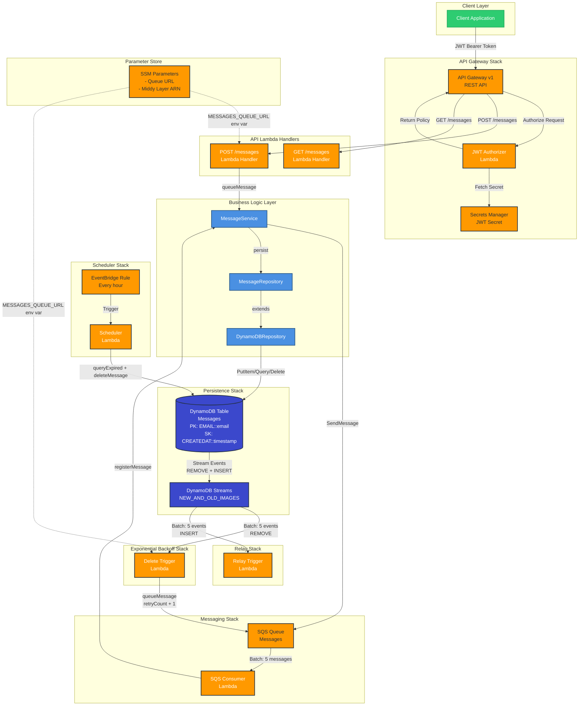
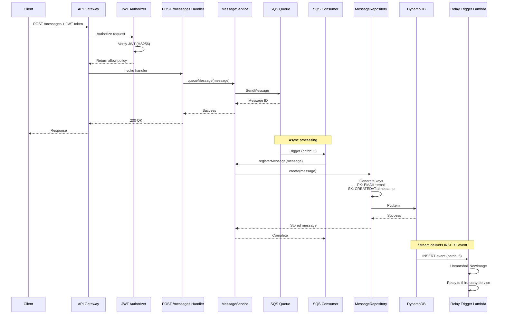
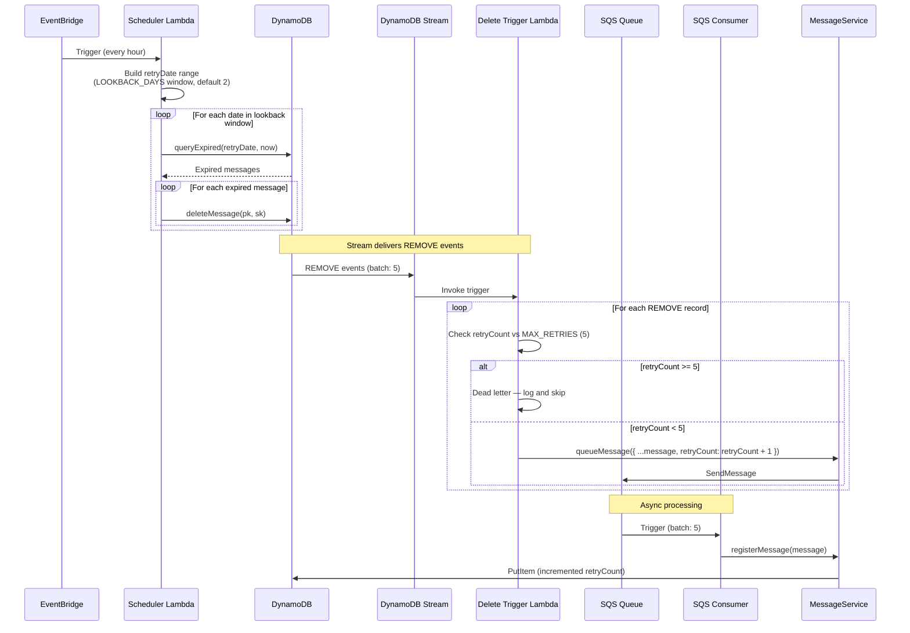

# System Architecture

## Component Diagram



## Data Flow Sequences

### 1. Message Submission Flow



### 2. Scheduled Retry Cycle (Exponential Backoff)



## Component Responsibilities

### Infrastructure Stacks

| Stack                       | Components                          | Responsibility                                     |
| --------------------------- | ----------------------------------- | -------------------------------------------------- |
| **BaseStack**               | Orchestrator                        | Coordinates all child stacks, manages dependencies |
| **PersistenceStack**        | DynamoDB Table                      | Message storage with streams enabled               |
| **MessagingStack**          | SQS Queue + Consumer                | Async message processing                           |
| **ApiStack**                | API Gateway + Handlers + Authorizer | REST API endpoints with JWT auth                   |
| **SchedulerStack**          | EventBridge + Lambda                | Scheduled retry jobs                               |
| **ExponentialBackoffStack** | DynamoDB Stream Trigger             | React to message deletions, re-queue for retry     |
| **RelayStack**              | DynamoDB Stream Trigger             | Relay inserted messages to third-party service     |

### Lambda Functions

| Function           | Trigger         | Purpose                                                                                                             |
| ------------------ | --------------- | ------------------------------------------------------------------------------------------------------------------- |
| **JWT Authorizer** | API Gateway     | Validates JWT tokens (HS256) from Secrets Manager                                                                   |
| **POST /messages** | API Gateway     | Queues new messages to SQS                                                                                          |
| **GET /messages**  | API Gateway     | Returns `501 Not Implemented` until the read model is built                                                         |
| **SQS Consumer**   | SQS Queue       | Persists messages to DynamoDB via `registerMessage`                                                                 |
| **Scheduler**      | EventBridge     | Queries messages by `retryDate` within a lookback window (`LOOKBACK_DAYS` env var, default 2); deletes expired ones |
| **Delete Trigger** | DynamoDB Stream | On REMOVE events, re-queues messages to SQS with `retryCount + 1`; dead-letters at `MAX_RETRIES = 5`                |
| **Relay Trigger**  | DynamoDB Stream | On INSERT events, relays newly persisted messages to third-party service                                            |

### Business Logic Layer

| Component              | Pattern            | Purpose                                                                   |
| ---------------------- | ------------------ | ------------------------------------------------------------------------- |
| **MessageService**     | Service Layer      | Central hub: `queueMessage`, `registerMessage`, `seedRetryMessage`        |
| **MessageRepository**  | Repository Pattern | Type-safe DynamoDB data access; `create`, `queryExpired`, `deleteMessage` |
| **DynamoDBRepository** | Generic Repository | Abstract DynamoDB CRUD operations                                         |

## Configuration and Shared References

Stacks and runtime components share configuration through **SSM Parameter Store** and **AWS Secrets Manager**:

```
/prod/messages/queue-url          → SQS Queue URL (MessagingStack → ApiStack, ExponentialBackoffStack)
/prod/messages/jwt-secret         → Secrets Manager ARN (ApiStack internal)
/prod/middy-lambda-layer-arn      → Middy Layer ARN (Shared across API handlers)
```

## Security Model

1. **Authentication**: JWT tokens (HS256) validated by custom authorizer
2. **Authorization**: API Gateway enforces authorizer on all routes
3. **Secrets**: JWT secret stored in AWS Secrets Manager (not SSM)
4. **Network**: All resources in us-east-1, no VPC (serverless only)

## DynamoDB Schema

**Table:** Messages  
**Primary Key:** `pk` (String) — Format: `EMAIL::${email}`  
**Sort Key:** `sk` (String) — Format: `CREATEDAT::${timestamp}`  
**Stream:** `NEW_AND_OLD_IMAGES` enabled

### Item Shape

```typescript
type Message = {
  firstName?: string
  lastName?: string
  email: string // Required
  phone?: string
  createdAt?: string // ISO timestamp; auto-set by MessageService
  data?: string
  retryCount?: number // Incremented on each retry cycle
  expirationAt?: string // ISO timestamp; record deleted when this passes
  retryDate?: string // YYYY-MM-DD; used by Scheduler to query candidates
}

// Stored record also includes repository-generated fields:
type MessageRecord = Message & {
  pk: string // EMAIL::${email}
  sk: string // CREATEDAT::${timestamp}
  id: string // 6-char hex (Nano ID)
}
```

## Technology Choices

| Technology                | Description                               |
| ------------------------- | ----------------------------------------- |
| Node.js 24.x              | LTS runtime, TypeScript execution via tsx |
| ARM64 (Graviton2)         | Lambda compute architecture               |
| Yarn 4.15.0               | Package manager                           |
| AWS CDK 2.x               | Infrastructure as code                    |
| API Gateway REST API (v1) | HTTP API with token authorizer support    |
| Middy                     | Middleware framework for Lambda handlers  |
| Jest + ts-jest            | Testing framework                         |
